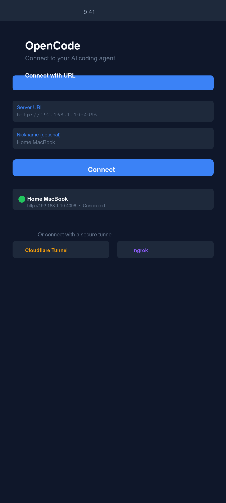
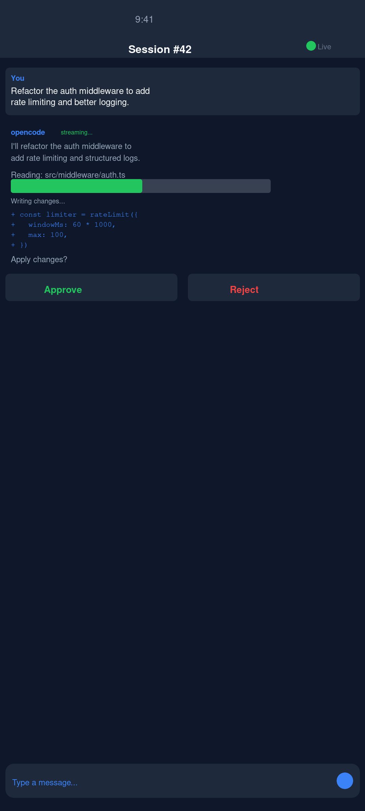
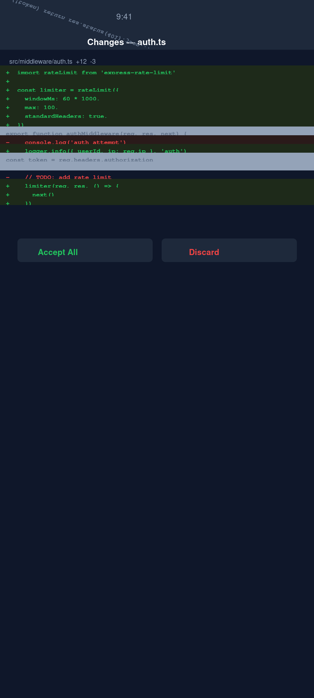

# OpenCode Mobile

**The open-source mobile client for the [opencode](https://github.com/sst/opencode) AI coding agent.**
AI-assisted coding from your phone — iOS, Android, and F-Droid.

[](LICENSE)
[](https://play.google.com/store/apps/details?id=ai.opencode.mobile)
[](https://apps.apple.com/app/opencode-mobile/id0000000000)
[](https://f-droid.org/packages/ai.opencode.mobile)
[](https://apt.izzysoft.de/fdroid/index/apk/ai.opencode.mobile)

---

OpenCode Mobile is a React Native / Expo app that brings the power of the [opencode](https://github.com/sst/opencode) AI coding agent to your phone. Connect to your own self-hosted opencode server over your local network, a Cloudflare Tunnel, ngrok, Tailscale, or the upcoming opencode Cloud — and write, review, and ship code from anywhere. The mobile client is **free and open-source** under the MIT license. There is no feature gate, no telemetry you did not opt into, and no ad network.

---

<p align="center">
  
  
  
</p>

---

## Features

- **Multi-connection** — manage multiple opencode servers (local network, Cloudflare Tunnel, ngrok, Tailscale, or opencode Cloud)
- **Biometric unlock** — Face ID, Touch ID, or Android fingerprint protects the app and individual message sends
- **Streaming chat** — token-by-token streaming responses directly from your opencode server
- **Diff viewer** — inline side-by-side diffs of every file change the agent makes
- **Tool call approval** — review and approve (or reject) tool calls before the agent executes them
- **Secure credential storage** — server credentials stored in iOS Keychain / Android Keystore via `expo-secure-store`
- **Session management** — browse, create, and resume coding sessions

---

## Get OpenCode Mobile

| Platform | Link |
|---|---|
| Google Play | [play.google.com — ai.opencode.mobile](https://play.google.com/store/apps/details?id=ai.opencode.mobile) |
| Apple App Store | [apps.apple.com — OpenCode Mobile](https://apps.apple.com/app/opencode-mobile/id0000000000) |
| F-Droid | [f-droid.org/packages/ai.opencode.mobile](https://f-droid.org/packages/ai.opencode.mobile) |
| IzzyOnDroid | [apt.izzysoft.de — ai.opencode.mobile](https://apt.izzysoft.de/fdroid/index/apk/ai.opencode.mobile) |

> **Note**: App Store and F-Droid listings are pending final review. Play Store internal testing is live.

---

## Quick Start

**Step 1 — Start opencode on your machine**

```bash
# Install opencode (if you haven't already)
npm install -g opencode

# Run opencode in server mode
OPENCODE_SERVER_PASSWORD=yourpassword opencode serve --hostname 0.0.0.0 --port 4096
```

**Step 2 — Install OpenCode Mobile** from any store above (or build from source — see [CONTRIBUTING.md](CONTRIBUTING.md)).

**Step 3 — Add a connection in the app**

Open the app, tap **Add Connection**, and choose your connection type:

- **Local network** — your machine's LAN IP, e.g. `http://192.168.1.100:4096`
- **Tunnel** — a Cloudflare Tunnel or ngrok URL, e.g. `https://my-opencode.trycloudflare.com`
- **Tailscale** — your machine's Tailscale IP, e.g. `http://100.x.x.x:4096`
- **opencode Cloud** *(coming soon)* — one-tap managed hosting, no server to run

Enter the password you set in Step 1, tap **Connect**, and you're in.

---

## How It Works

OpenCode Mobile is a thin client. It speaks the opencode HTTP + SSE API: listing sessions, sending messages, streaming responses, and subscribing to file-change events. All AI model calls are handled by your opencode server — you bring your own API keys (OpenAI, Anthropic, etc.) and the app never touches them. The app never proxies your code or conversation through our servers.

```
┌─────────────────────────────────────┐
│         OpenCode Mobile             │
│  (React Native / Expo, this repo)   │
└──────────────┬──────────────────────┘
               │  HTTP + SSE
               │  (local network / tunnel / cloud)
               ▼
┌─────────────────────────────────────┐
│       opencode server               │
│  (github.com/sst/opencode, MIT)     │
│  Running on your laptop / VPS       │
└──────────────┬──────────────────────┘
               │  API calls
               ▼
┌─────────────────────────────────────┐
│   Your AI provider                  │
│  (OpenAI / Anthropic / Gemini / …)  │
│  Your keys, your bill               │
└─────────────────────────────────────┘
```

---

## Project Status

**Current version: v0.2.3**

| Feature | Status |
|---|---|
| Multi-connection management | Stable |
| Session list + creation | Stable |
| Streaming chat | Stable |
| Diff viewer | Stable |
| Biometric unlock | Stable |
| Tool call approval UI | Stable |
| Sentry crash reporting (opt-in) | Stable |
| Cloudflare / ngrok tunnel wizard | Beta |
| opencode Cloud one-tap connect | Planned |
| iPad / tablet layout | Planned |
| Offline session history | Planned |

---

## Supporters and Sponsors

OpenCode Mobile is built and maintained by [VIBE TECHNOLOGIES, LLC](https://opencode.vibebrowser.app). GitHub Sponsors help cover Sentry, EAS Build, and CI costs (~$60/month). The opencode Cloud hosted backend (planned, $10/mo) is the long-term revenue model.

If OpenCode Mobile saves you time, consider sponsoring:

**[github.com/sponsors/VibeTechnologies](https://github.com/sponsors/VibeTechnologies)**

| Tier | Price | Perk |
|---|---|---|
| Supporter | $5/mo | Your name in `SUPPORTERS.md` |
| Backer | $15/mo | Name + early access to opencode Cloud beta |
| Business | $50/mo | Logo on [opencode.vibebrowser.app](https://opencode.vibebrowser.app) + quarterly support call |

Questions or private support: [support@vibebrowser.app](mailto:support@vibebrowser.app)

---

## Roadmap

Tracked on the [GitHub Projects board](https://github.com/dzianisv/opencode-mobile/projects) and in the [open milestones](https://github.com/dzianisv/opencode-mobile/milestones).

Near-term priorities:
- opencode Cloud one-tap connect + managed hosting
- F-Droid mainline acceptance (FCM audit + reproducible build verification)
- Tunnel setup wizard (Cloudflare / ngrok / Tailscale)
- iPad / tablet layout
- Offline session history cache

---

## Contributing

We welcome bug reports, feature requests, and pull requests. See [CONTRIBUTING.md](CONTRIBUTING.md) for how to set up a dev environment and the contribution process.

---

## Privacy

OpenCode Mobile does not collect personal data. Optional Sentry crash reporting (opt-in, off by default) sends anonymised crash traces to Sentry. No analytics SDKs are bundled. Credentials are stored exclusively on-device in the OS keystore.

Full privacy policy: [opencode.vibebrowser.app/privacy](https://opencode.vibebrowser.app/privacy)

---

## License

MIT — see [LICENSE](LICENSE).

Copyright (c) 2026 VIBE TECHNOLOGIES, LLC

---

## Acknowledgments

- [sst/opencode](https://github.com/sst/opencode) — the AI coding agent this app connects to (MIT)
- [Expo](https://expo.dev) — the React Native toolchain powering the app
- Every contributor who filed a bug, opened a PR, or starred the repo
